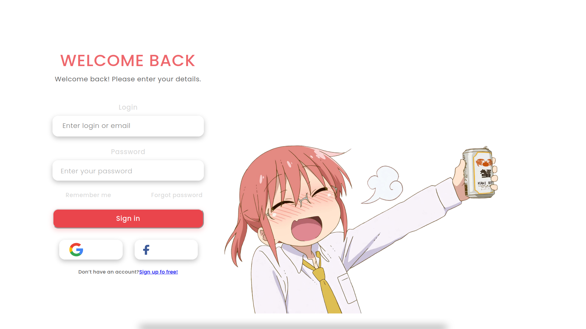
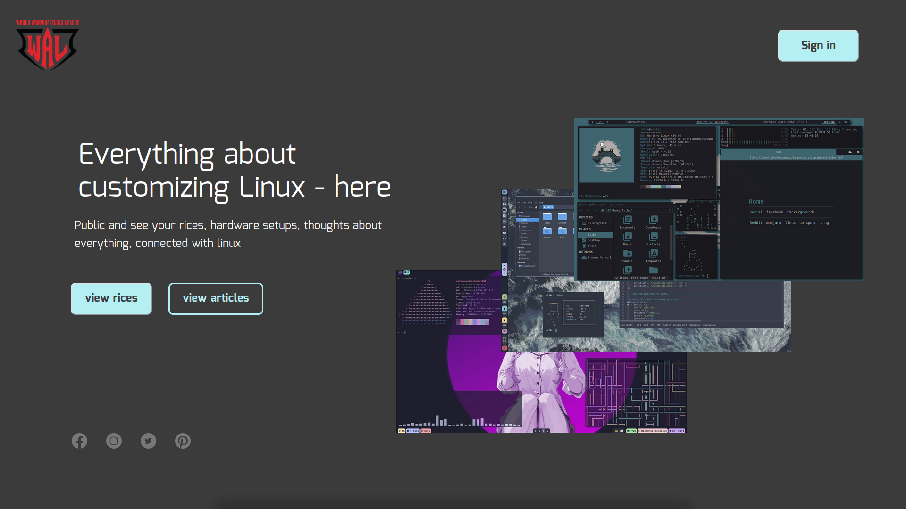

# Boilerplate личного кабинета с фронтендом и аутентификацией
Используемые технологии:
- Go
- Docker
- MySQL

## Запуск
### Без Docker

1) `go run backend/cmd/base/main.go`

2) http://localhost:8080

### С Docker
`docker-compose up`

# Результат

